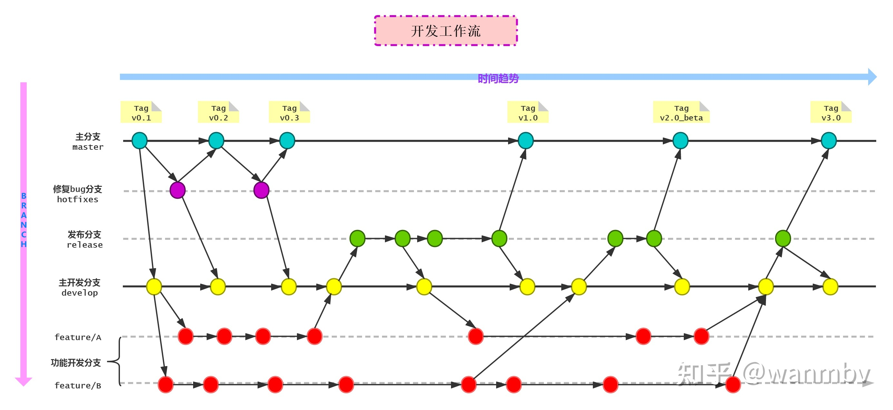

### 前端会议流程

0. 以后每周都会有前端周会
1. 每个人在这一周总结项目中遇到的情况，好的解决方案是怎样的(3-5分钟/人)
2. 前端技术分享(20分钟-30分钟)，陈觉敏-泰霖-贞标-涛勇

### Git 团队流程

Git 流程规范化

## 提交流程

- 在 `Dev` 创建功能分支(小功能，可以省功能分支，直接在 Dev 开发)
- 在 `feature/A` 功能分支开发,完成后合到 `Dev`, 并合到 `Test`, 通过 `cherry pick`, 多个 `cherry pick` 通过 `rebase` 合并, 再 `cherry pick` 到 `TEST`
- 有 Bug 在 `Dev` 修复后，并合到 `Test`
- 没 Bug 后提交 Gitlab **MR** 给我 **Review**, 合到 `Master`

### Git message 规范

- `feat:` 新增功能
- `fix:` 修复 Bug
- `docs:` 文档注释
- `refactor:` 重构
- `perf:` 性能
- `test:` 增加测试

### Rebase vs Merge

- [Git merge和rebase分支合并命令的区别](https://juejin.cn/post/6844903603694469134)

### 图形化 Git

- SourceTree
- GitFlow
- GitKarken

### 参考链接

- [如何优雅地使用 Git](https://juejin.cn/post/6844903546104135694)

- [面试中的那些 Git 问题 - 基础部分](https://juejin.cn/post/6844903505333878798#heading-9)
