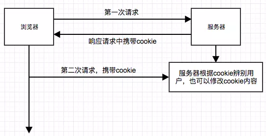

## Cookie

HTTP Cookie 是服务器发送到用户浏览器并保存在本地的一小块数据，它通常会在浏览器发送请求时被携带并发送到服务器上面。因为 HTTP 是无状态协议，所以常会使用 Cookie 来记录 HTTP 的信息状态。

Cookie主要用在下面这三个方面:

- 会话状态管理(用户登录状态，购物车，游戏分数或其它需要记录的信息)

- 个性化设置(用户自定义设置、主题等)

- 浏览器行为跟踪(跟踪分析用户行为等)

### Cookie 原理

因为 Cookie 在多个标准中功能已经发生了变化，所以也存在很多创建访问 Cookie 的方式，可以通过 JS 脚本创建访问，也可以通过 HTTP 响应头创建访问，下面说一下最新创建 Cookie 的原理.

当浏览器发送一个请求给服务器，服务需要缓存一个状态时，服务器会在响应头设置参数 `Set-Cookie` 来设置一些 Cookie 的值。这些值会被保存在浏览器 Cookie 中，当第二次请求的时候就会携带 `Cookie` 的值去服务器那边，来判断用户的状态。

Cookie 是以键值对传送和保存的 `NAME=VALUE`

Cookie 除了 `Name` 和 `Value` 外有以下这些属性：

- **Domain**

这个属性指的是作为 Cookie 适用对象的域名，如果不指定则会默认为文档所在的文件目录。

- **Path**

指的是服务器上的文件目录作为 Cookie 的适用对象, 如果不指定则默认为文档所在的文件目录。

- **Expires/Max-Age**

有效期，可以设计 Cookie 的有效期时间，如果不设置值则默认为浏览器关闭前删除。
`Expires`可以具体的时间节点。
`Max-Age`是以秒为单位的设置，如果有效期已过则会失效删除。

- **Secure**

该值设为 `true` 时，会在 HTTPS 安全通信时才会发送 Cookie ,不安全的协议不会传送，但设置了也并不能绝对保证 Cookie 的安全性和加密。

- **HttpOnly**

该值为 `true` 时, 表示只能给 HTTP 请求头读写，不能通过 JS 脚本来获取和写入 Cookie 的值，能防止 XSS 攻击。

- **SameSite Cookies**[实验属性]

`SameSite Cookie` 允许服务器要求某个 cooike 在跨站请求时不会被发送，从而可以阴止跨站请求伪造攻击(CSRF)，并不是所有主流浏览器都已经支持。

1. `None` 浏览器会在同站请求、跨站请求下继续发送cookies, 不区分大小写。
2. `Strict` 浏览器只发送相同站请求求的 cookie， 如果请求和当前的 loaction 的 URL 不一致，则不会发送。
3. `Lax` 是默认选项目，`Same-site cookies` 将会为一些跨站请求保留，如图片加载或 frames 调用等，只有当用户从外部站点导航到 URL 时才会发送。

### Cookie 分类

#### 分话期 Cookie

会话期 Cookie 就是不需要指定过期时间 `Expires` 或有效期 `Max-Age`，浏览器关闭之后它会被自动删除，就是它公在会话期内有效。有些浏览器提供了会话恢复功能，即使关闭浏览器，会话期 Cookie 也会被保留。

#### 持久性 Cookie

持久性 Cookie 可以指定一个特定的过期时间 `Expires` 或有效期 `Max-Age`, 设定有效期后过期才会失效。

### 参考引用

- [把cookie聊清楚](https://juejin.im/post/59d1f59bf265da06700b0934)
- [HTTP cookies](https://developer.mozilla.org/zh-CN/docs/Web/HTTP/Cookies)