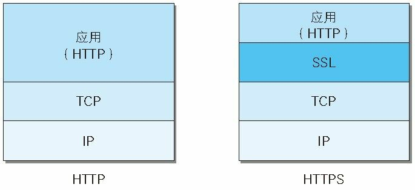
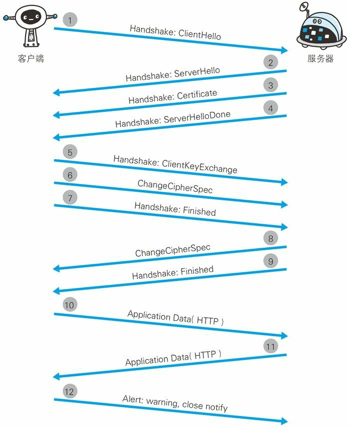

## HTTPS

其实 HTTP 协议并不是一个安全的协议:

- 因为 HTTP 协议中没有加密机制，通信使用明文(不加密), 内容有可能会被窃听的可能性。

  防止被窃听可以有下面两种解决方案:

  - HTTP 可以通过和 SSL(Secure Socket Layer, 安全套接层) 或 TLS(Transport Layer Security, 安全层传输协议) 的组合加密 HTTP 通信内容。与 SSL 组合使用又被称为 HTTPS（HTTP Secure, 超文本传输安全协议）又或 HTTP over SSL。

  - 内容加密，可以对报文主体进行加密处理，但是为了做内容加密处理，客户端和服务器都要同时具备加密和解密机制，因为不同于整个线路加密，所以内容仍有被修改的风险。

- 因为 HTTP 实现很简单，所以不论谁发送过来的请求都会返回响应，不验证通信方的身份，因此有可能遭遇伪装。如果使用了 SSL 全链路加密，则会带上第三方证书手段去验证各方真实身份。

- 无法证明报文的完整性，在传输的过程中虽然有 MD5 或 PGP 来保证文件一致性，但仍有可能被第三方更改，所以还是需要使用 SSL 输传比较靠谱。

为解决上面 HTTP 安全性问题，通常使用加密认证机制的 HTTP 称为 HTTPS(HTTP Secure)。

使用 HTTPS 会使用标识在 URI，不再是 `http://` 而是 `https://`, HTTPS 并不是应用层的一种新的协议，而是身披 SSL 外壳的 HTTP ，只是通信接口部分用 SSL 和 TLS 协议代替。

上面可以知道增加 SSL 后可以保证 HTTP 的安全性，但是使用 SSL 后 HTTPS 会比 HTTP 慢因为要加解密消耗 CPU 资源，要验证证书，还要进行 SSL 通信等，会使 HTTPS 比 HTTP 慢很多倍。

### HTTPS 客户端和服务器的连接流程

