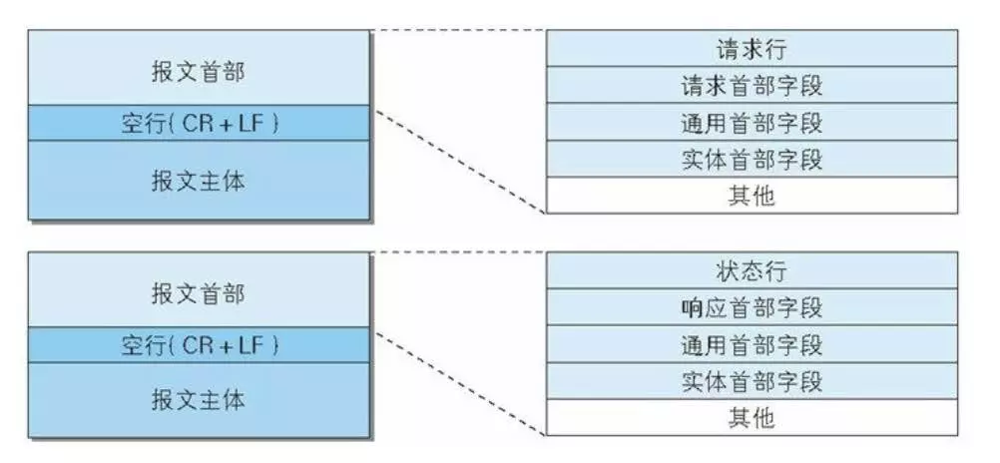

## HTTP报文与编码传输

### HTTP报文

用于 HTTP 协议交互的信息被称为 HTTP 报文。报文为分两类:

1. 请求报文，由客户端发起的。
2. 响应报文，由服务端发出的。

HTTP 报文里面可分为两个部分: **报文首部**和**报文主体**，中间由 `CR+LF` 格开。



报文首部一般有4部分，分别是：**通用首部**、**请求首部**、**响应首部**和**实体首部**。

### 编码提升速率

在 HTTP 传输报文数据的时候可以按照数据的原貌直接传输，但是一般不会这样做，因为直接传输会影响传输速率。所以一般会进行传输编码，编码后能有效的提高速率，提高处理大量的访问请求，因为编码需要机算机完成，所以也会花费 CPU 资源。内容编码后也会进行压缩，是在实体信息原样上面压缩。常用的编码有下面几种:
- gzip(GNU zip)
- compress(UNIX 系统的标准压缩)
- deflate(zlib)
- identity(不进行编码)

在传输数据大量的时候，通过把数据分割成多块进行传输，浏览器这样能逐步显示页面。这种把实体主体分块的功能称为分块传输编码(Chunked Transfer Coding),分块传输的编码块会在客户端里面重新组装并解码，恢复原来的实体主体。

在 HTTP 报文主体传输的过程中，因为除了传输文本外，还可能传输图片，视频音频等多个不同类型的数据，所以HTTP采用了 **MIME**(Multipurpose Internet Mail Extensions, 多用途因特网邮件扩展)机制里面的一种多部分对象集合(Multipart)的方法，来容纳不同类型的数据。 
多部分对象集合包含的对象有下面这些:
- multipart/form-data
- multipart/byteranges

```js
//报文 header
Content-Type: multipart/form-data; boundary=AaB03x
```

```
--AaB03x
Content-Disposition: form-data; name='field1'
Joe Blow
--AaB03x
Content-Disposition: form-data; name='pics'; filename="file1.txt"
Content-Type: text/plain
--AaB03x--
```

在报文头部会有 `Content-Type` 声明数据类型，如果是 `multipart` 还会有一个 `boundary` 值来区分各个实体的分隔，最后以`--${boundary}--`标识结束。


### 范围请求头

如果下载的实体内容很大，那么就可以在请求首部设定一个范围参数 `Range`

```js
// 客户端
GET /tip.jpg HTTP/1.1
Host: www.usagidesign.jp
Range: bytes = 5001-10000 // 请求范围
```

```js
// 服务器，响应端
HTTP/1.1. 206 Partial Content
Date: Fri, 13 Jul 2012 04:39:17 GMT
Content-Range: bytes 5001-10000/10000 // 返回 5001-10000 的内容
Content-Length: 5000
Content-Type: image/jpeg
```
如果需要返回`5000`字节以后全部内容写成, `5001-`,也可以设成多重范围 `0-3000, 5000-7000`

### 内容协商

内容协商机制是指客户端和服务器端就响应的资源内容进行交涉，然后提供给客户端最为适合的资源。协商判断是根据请求报文中的首部字段为基准的，字段有下面这些:
- Accept
- Accept-Charset
- Accept-Encoding
- Accept-Language
- Content-Language

协商技术有三种类型:

1. 服务商戏动协商（Server-driven Negotiation)
由服务器端进行内容协商，根据请求的首部字段为参考，在服务器端自动处理。

2. 客户端驱动协商（Agent-driven Negotiation）
客户端进行内容协商的方式，用户从浏览器显示的可选项列表中手动选择。

3. 透明协商(Transparent Negotiation)
由服务器和客户端各自进行内容协商


### 参考引用

- [MIME 类型](https://developer.mozilla.org/zh-CN/docs/Web/HTTP/Basics_of_HTTP/MIME_types)