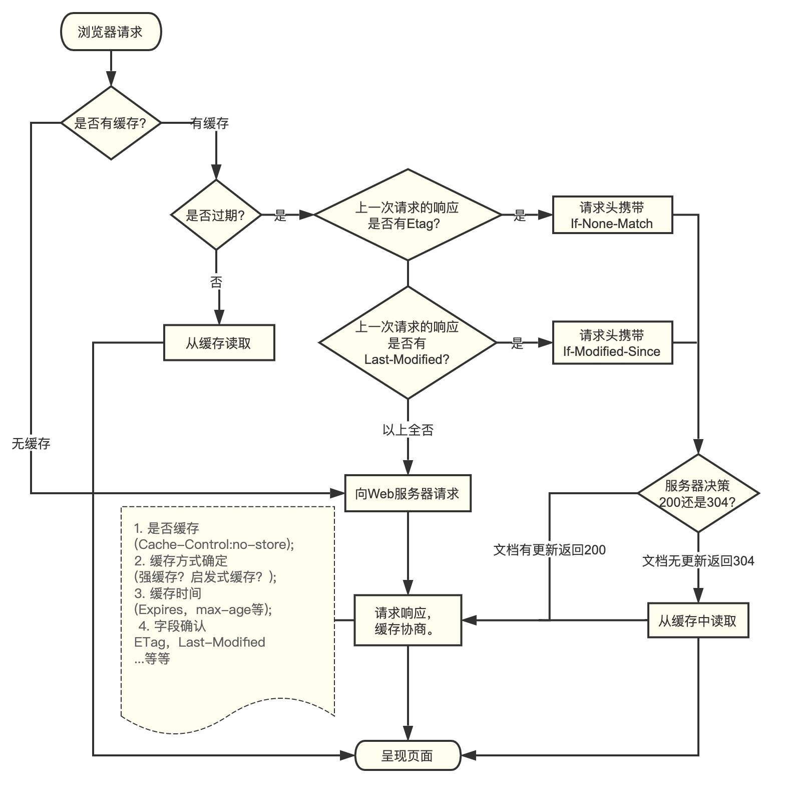

## HTTP缓存机制

缓存是指代理服务器或客户端本地磁盘内保存的资源副本。利用缓存可减少对源服务器的访问，因此也就节省了通信流量和通信时间。

### 缓存分类

1. 客户端缓存

缓存不但可以存在缓存服务器内，还可以请求在客户端浏览器中，被称为临时网络文件。浏览器缓存也一样如果有效期还没过，就直接使用本地的缓存，如果判断浏览器缓存失效，则会再次请求新的资源。

2. 代理服务器缓存

代理服务器缓存是指代理服务器的一种，当代理转发从服务器返回的响应时，代理服务器将会保存一个资源的副本，当再次请求资源时可以从副本中直接返回，不需要再对源服务器发送多次请求。缓存是存在有效期限的，当资源已过期或者客户端要求的情况下会再次向源服务器上发出请求获取最新资源。

代理服务器的缓存是一个共享缓存，不只是为一个用户服务，经常为大量用户使用，因此在减少相应时间和带宽方面能提高效率，因为同一个缓存可能会被重用多次。

3. 网关缓存

网关是一个中间服务器，网关缓存一般是网站管理员自己部署缓存，从而让网站拥有更好的性能。一般 CDNS (网络内容分发商) 分布网关缓存到互联网上，并出售缓存服务给其它网站，比如七牛云、又拍云服务等。

### 概念

- **ETag** 全称请求变量的实体值(Entity Tag), `ETag` 是服务端的一个资源的标识符，是一种可将资源以字符串形式做唯一性标识的方式，如果给定的 URL 中的资源更改了，则一定要生成新的 `ETag` 值,来表示资源的唯一值。资源被缓存时，就会被分配唯一性标识 `ETag`, 一般可以用 `ETag` 来判断资源更新的变化来控制缓存机制。

`ETag`分两种:

1. 强 `ETag` 值，不论实体发生多么细微的变化都会改变期值。
`ETag: "usagi-1234"`

2. 弱 `ETag` 值，弱 `ETag` 值只用于提示资源是否相同。只有资源发生了根本改变，产生差异时才会改变 `ETag` 值。这时，会在字段最开始处附加 `W/`
`ETag: W/"usagi-1234"`  


### 浏览器缓存机制

浏览器对于缓存的处理是根椐第一次请求资源时返回的响应头来确定的。分为强缓存阶段、启发式缓存阶段、协商缓存阶段。

- 强缓存阶段

```js
//服务器请求头
Age:23146
Cache-Control:max-age=2592000
Date:Tue, 28 Nov 2017 12:26:41 GMT
ETag:W/"5a1cf09a-63c6"
Expires:Thu, 28 Dec 2017 05:27:45 GMT
Last-Modified:Tue, 28 Nov 2017 05:14:02 GMT
Vary:Accept-Encoding
```

在浏览器请求访问某个资源文件，浏览器会首先判断是否之前有访问过该资源保留下来的缓存，如果有会判断是否缓存已经过期，没过期引用缓存，已过期则进入协商缓存阶段。
在强缓存阶段会通过请求头下面这些参数判断是否已过期:
1. `Cache-Control: max-age` 能控制缓存模式，并且通过 `max-age` 和 `Date` 估算实际在浏览器过期时间。
2. `Expires` 也是旧版 HTTP/1.0 设定过期日期时间。版本高优先原理，`max-age > Expires`
3. `Pragma` 旧版 HTTP/1.0 设定缓存模式。版本高优先原理，`Cache-Control > Pargma`
4. `Date` 具体创建报文日期时间。

- 启发式缓存阶段

```js
// 服务器响应头
Age:23146
Cache-Control: public
Date:Tue, 28 Nov 2017 12:26:41 GMT
Last-Modified:Tue, 28 Nov 2017 05:14:02 GMT
Vary:Accept-Encoding
```

当服务器响应头，像上面的例子一样没有用来确定缓存过期时间的字段，那怎办？浏览器会进行启发缓存阶段，会根据响应头中的两个时间字段 `Date` 和 `Last-Modified` 来判断时间差值，取值 10% 作为缓存时间周期判断是否过期。

- 协商缓存阶段

```js
//服务器请求头
If-Modified-Since: Tue, 28 Nov 2017 05:14:02 GMT
If-None-Match: W/"5a1cf09a-63c6"
```

当缓存过期后就会进行协商缓存阶段，会根据 `Last-Modified` 和 `ETag` 值来判断代理缓存资源是否仍有效。

`Last-Modified` 对应 `If-Modified-Since` 参数的值，判断是否有新修改的内容。

`ETag` 对应 `If-None-Match` 参数的值，判断是否有新资源的更改。

如果缓存资源没有修改，则会返回状态码 **304** 表示资源没有修改引用旧有缓存，如果有资源修改则会请求源服务器返回更新资源返回状态码 **200**。如果 `If-None-Math` 和 `If-Modified-Since` 不匹配则会返回 **412** 状态码表示，判断条件不匹配。

下图解释了缓存机制全部流程：

引用至 Damonarel [缓存详解](https://juejin.im/post/5a6c87c46fb9a01ca560b4d7#heading-2)

### 参考引用

- [你知道HTTP协议的ETag是干什么的吗？](https://juejin.im/post/5d07a0fcf265da1ba56b1f15)
- [ETag_MDN](https://developer.mozilla.org/zh-CN/docs/Web/HTTP/Headers/ETag)
- [什么是Etag](http://ysha.me/2016/07/25/07-25-%E4%BB%80%E4%B9%88%E6%98%AFEtag/)
- [HTTP----HTTP缓存机制](https://juejin.im/post/5a1d4e546fb9a0450f21af23)
- [缓存详解](https://juejin.im/post/5a6c87c46fb9a01ca560b4d7#heading-2)
- [浅谈浏览器http的缓存机制](https://www.cnblogs.com/vajoy/p/5341664.html)
- [http缓存与cdn缓存配置指南](http://dopro.io/http-cache-and-cdn-cache.html)
- [深入理解浏览器的缓存机制](https://mp.weixin.qq.com/s/HIUtWfQg4uwvYPy9zpESNQ)
- [彻底弄懂HTTP缓存机制及原理](https://www.cnblogs.com/chenqf/p/6386163.html)
- [一文读懂前端缓存](https://juejin.cn/post/6844903747357769742)
