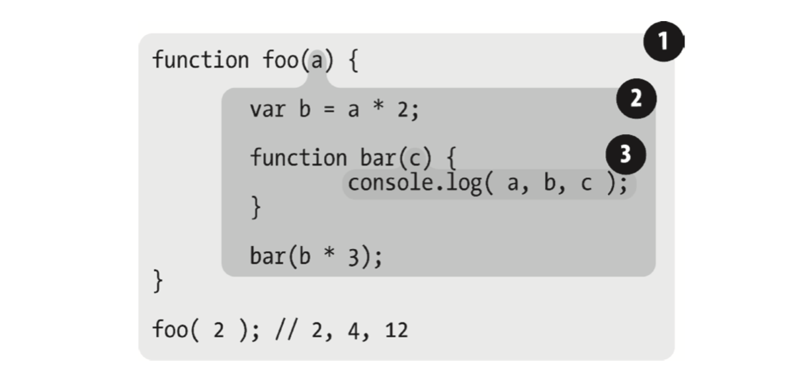

## 作用域

### 编辑语言作用域分类

在编程语言里面有两种主要的作用域工作模型：
1. **词法作用域**(LexicalScope), 是被大多数编程语言所采用的。词法作用域就是定义在词法阶段的作用域，简单点说，就是写代码时把变量和块作用域写在哪里来决定的，因此词法分析器处理代码时会保持作用域不变。



像上图子层作用域只会对当前块产生影响。遇到当前作用域找不到相关变量就会逐层向上查找。


2. **动态作用域**(Dynamic Scope)，是一些少部分编程语言在使用的(比如 Bash 脚本，Perl 中的一些模式等)。动态作用域关注的是函数从何处调用，其作用域链是基于运行时的调用栈的。


### JavaScript 的作用域

#### 函数作用域
函数作用域是 JavaScript 中最常见的作用域单元，可以隐藏内部实现，封闭小单位的变量和逻辑，将其变量或函数私有化，减少暴露在污染全局空间，外部作用域无法访问函数内部的任何内容。


#### 块作用域
块作用域是指在程序块里面的作用域一般是指在大括号中`{}`的作用域，但是 JavaScript 在ES6之前都没有块级作用域，因为 `var` 的变量声明，都会把变量穿透了块级作用域，比如:

```js
for (var i=0; i<5; i++) {
  console.log(i)
}
console.log(i) // 5
or 
if (true) {
 var i = 2
}
console.log(i) // 2
```

在 ES6 后可以通过 `let` 和 `const` 关键字来实现，块级作用域的条件使用一个 `{ }` 包裹就成。

如果使用其它方法实现块作用域，可以使用**函数作用域**、**IIFE**、**with**或者利用**try/catch**在 catch 分句里面实现块作用域。

#### 全局作用域

全局作用域是指，全局变量下的生命周期，在 JavaScript 最底层运行栈下，声明的变量和函数都将存在于整个程序之内，可以被程序中任何函数或者方法访问。

### JavaScript 的欺骗词法作用域

JavaScript 可以通过下面两种方法来修改词法作用域，但是缺点也是明显的，这样操作会导致性能下降， 并且在严格模式下是被禁止的。

#### with
`with` 可以绑定一个对象里面的作用域，在里面操作属性不需要重复引用对象本身。

```js
var obj = {
  a: 1,
  b: 2,
  c: 3,
}
obj.a = 2
obj.b = 3
obj.c = 4
// or
with(obj) {
  a = 3
  b = 4
  c = 5
}
```


#### eval

`eval(...)` 函数可以接受一个字符串作为参数，并调用 `eval` 方法的时候再把字符串执行，就好像字符串是运行在当前 `eval` 运行的地方，运行在 `eval` 运行的词法期。`str` 是可以动态生成的，所以效率会其差。

```js
function foo(str, a) {
  eval(str)
  console.log(a, b)
}
var b = 2
foo('var b = 3;', 1) // 1, 3
```

`eval` 和 `with` 都会在运行时修改或创建新的作用域，因此来欺骗其它的词法作用域，但是在 JavaScript 引擎中编译阶段进行的各种性能优化，预到上面这两个方法可能就起不了作用了。