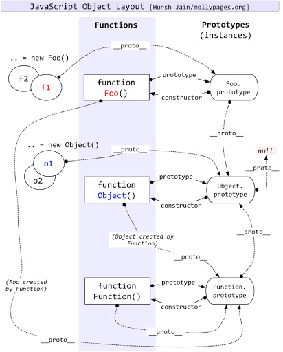

## 原型

### [[Prototype]]
JavaScript 中的对象有一个特殊的 [[Prototype]]内置属性，其实就是对于其他对象的引用。

访问对象属性会先访问[[Get]]，获取当前对象属性，如果不存在则会在[[Prototype]]原型链上面查找，

```js
var anotherObject =  {
  a: 2
}
var myObject = Object.create(anotherObject)

for (var k in myObject) {
  console.log('found:' + k) // a
}
('a' in myObject)  // true
```
通过 `Object.create` 创建一样能关联 [[Prototype]]



对于对象的[[prototype]] 尽头是 `Object.prototype`, 很多属性和方法都是 `Object.prototype` 上携带的。

```js
var anotherObject = {
  a: 2
}
var myObject = Object.create(anotherObject)

anotherObject.a //  2
myObject.a // 2

anotherObject.hasOwnProperty('a') // true
myObject.hasOwnProperty('a') // false

myObject.a++

anotherObject.a // 2
myObject.a // 3 myObject 自身创建了属性并，赋值添加

myObject.hasOwnProperty('a')
```

### 类函数

```js
function Foo() {
  // ...
}
var a = new Foo() // 在 new 后，会在对象 a 创建一个 [[Prototype]] 指向 Foo.prototype 所指的对象
Object.getPrototypeOf(a) === Foo.prototype // true
```

`a` 通过 `new` 创建后，会在 `a` 对象内的 [[Prototype]] 链接到 `Foo.prototype` 所指向的原型对象。


### 构造函数

```js
function Foo() {
  // ...
}
Foo.prototype.constructor === Foo // true
var a = new Foo()
a.constructor === Foo // true 创建的对象也有 constructor 指向，构造函数
```

在 JavaScript 界里面，类名是需要大写开头的。

构造函数中原型对象中添加属性，会在实体对象中引用中出现。

```js
function Foo(name) {
  this.name = name
}
Foo.prototype.myName = function() {
  return this.name
}

var a = new Foo('a')
var b = new Foo('b')

a.myName() // a
b.myName() // b
```

制造假的构造函数 `constructor`

```js
function Foo() {}
Foo.prototype = {} // 新建一个空对象

Object.defineProperty(Foo.prototype, 'constructor', {
  enumerable: false,
  writable: true,
  configurable: true,
  value: Foo // 让 .constructor 指向 Foo
})
```

### 原型继承

```js
function Foo(name) {
  this.name =  name
}
Foo.prototype.myName = function() {
  return this.name
}
function Bar(name, label) {
  Foo.call(this, name)
  this.label = label
}
Bar.prototype = Object.create(Foo.prototype)
Bar.prototype = Foo.prototype // 错误，这样会把 Bar 的原型对象关联到 Foo的原型对象
Bar.prototype = new Foo() // 错误，会有副作用
Bar.prototype.myLabel = function() {
  return this.label
}
var a = new Bar('a', 'obj a')

a.myName() // 'a'
a.myLabel() // 'obj a'
```