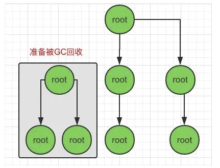

## JS引擎(V8)的垃圾回收机制

JavaScript 不像其它语言一样可以，手动触发垃圾回收，而 V8 引擎会帮助我们自动垃圾回收管理，利用浏览器渲染页面的空闲时间进行垃圾回收。

1. 引用计数垃圾收集

在引用计数垃圾收集策略中，主要是跟踪记录每个值被引用的次数，当声明一个变量并将一个引用的类型值赋值给该变量时，则该变量次数就是1，如果该值引用次数变成 0 的时候，则说明没办法再访问这个值了，当下次垃圾收集器再运行的时候，就会释放那些引用次数为0所占用的内存。

缺点: 如果当两个对象相互引用的时候，就会出现**循环引用**，引用计数这策略就没办法清除这循环的内存。

解决方法: 一般在生命周期结束或者

不过在2012年起 V8 引擎对引用计数垃圾收集策略就不太使用了。

2. 标记清除(Mark-Sweep)

在标记-清除垃圾收集策略中，会设置一个 根(Root) 对象，垃圾回收器会定期从根开始，从引用树中查找对象的引用，如果当前引用已经脱离了当前根，就会标记为无法访问这些变量，下一次垃圾回收的时候，就会清理掉。

3. 标记整理(Mark-Compact)

因为当垃圾回收后，一部分内存空间就会重新释放出来，会变成内存空间不连续，标记整理会重新把还在使用的重新整理，存放在内存的另一侧，重新排列会变成连续的内存空间。因为要连续的内存空间，所以相对速度会慢一些。

### V8垃圾回收策略

自动垃圾回收有很多算法，由于不同对象的生存周期不同，所以无法只用一种回收策略来解决问题，这样效率会很低。所以 V8 采用了一种代回收的策略，将内存分为两个生代: **新生代(new generation)** 和 **老生代(old generation)**，新老生代分别采用不同的垃圾回收算法来提高效率，对象最开始都会先被分配到新生代，在新生代满足一定条件后，会被晋升到老生代。

**新生代**:
  - 新生代中保存对象存活时间较短的对象
  - 新生代采用 **Scavenge** 垃圾回收算法，主要通过 **Cheney** 算法实现, **Cheney** 算法，会把内存一分为二，一部分记录内存对象，另一部分闲置，当一段时间后会重新把活跃对象整理到，闲置部分，再交替操作。

**老生代**:
  - 老生代中的对象为存活时间较长或常驻的对象
  - 当一个对象多次交换存活后，它就会被认为是生命周期较长的对象，会被移动到老生代中。
  - 老生代采用 **Mark-Sweep**, **Mark-Compact** 的组合进行垃圾回收

### 参考连接

[内存管理](https://developer.mozilla.org/zh-CN/docs/Web/JavaScript/Memory_Management)

[jsliang 求职系列 - 19 - 垃圾回收](https://juejin.cn/post/6896988786547228679)

[由一道腾讯面试题聊聊 V8 引擎的垃圾回收](https://mp.weixin.qq.com/s/cFGHz7FYG9CzpOE-QSMRDg)

[聊聊V8引擎的垃圾回收](https://juejin.cn/post/6844903591510016007#heading-10)