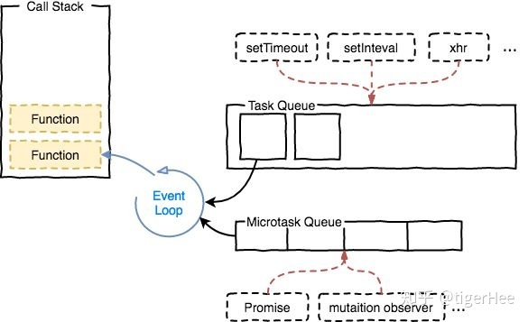

## EventLoop

#### 什么是 EventLoop

EventLoop 是指一套事件循环并发模型，因为 JavaScript 是一个单线程脚本语言，所以执行事件的顺序就会变得很重要，而事件循环(EventLoop)，就是负责执行代码、收集和处理事件以及执行队列中每次轮回执行顺序的原理模型。
由于输入输出和执行体不一样，这使到浏览器下的 EventLoop 和 Node 的 EventLoop 不一样，虽然他们都是基于 V8 引擎。

#### 浏览器的 EventLoop

在浏览器执行脚本代码的时候，会把同步任务都在主线程上面执行，形成一个执行栈，而异步就会加入任务队列里面，而异步任务会分成两类，宏任务和微任务：

宏任务(macrotasks):

宏任务包括事件： `setTimeout`、`setInterval`、`setImmediate`、`requestAnimationFrame`、`I/O`、`Network`

微任务(microtasks):
微任务包括事件： `Promises.then`、`Promise.catch`、`Promise.finally`、`queueMicroTask`、`MutationObserver`

### 流程

1. V8 执行脚本，运行代码把同步代码放放主执行栈。
1. 异步事件加入到任务集合。
1. 从任务集合里取出一个宏任务并执行。
1.

上图是浏览器在 1 帧(1Frame)里, 运行 Event Loop 和 渲染流程图。

基于[深入解析你不知道的 EventLoop 和浏览器渲染、帧动画、空闲回调（动图演示）](https://juejin.cn/post/6844904165462769678)整理

## 参考连接

[JavaScript 运行机制详解：再谈Event Loop__阮一峰](http://www.ruanyifeng.com/blog/2014/10/event-loop.html)

[深入解析你不知道的 EventLoop 和浏览器渲染、帧动画、空闲回调（动图演示）](https://juejin.cn/post/6844904165462769678)

[浏览器的 Event Loop](https://mp.weixin.qq.com/s/8ldkuaoZHqAiofJtPi6nzA)

[事件循环：微任务和宏任务](https://zh.javascript.info/event-loop)

[微任务、宏任务与Event-Loop](https://juejin.cn/post/6844903657264136200)

[js中的宏任务与微任务](https://zhuanlan.zhihu.com/p/78113300)