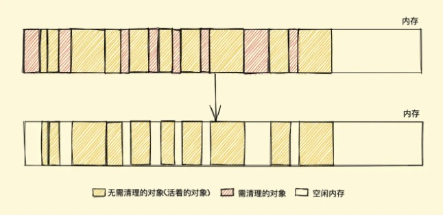
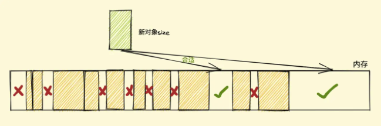
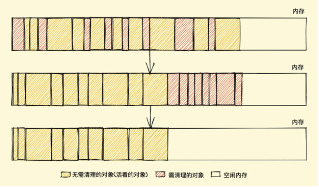
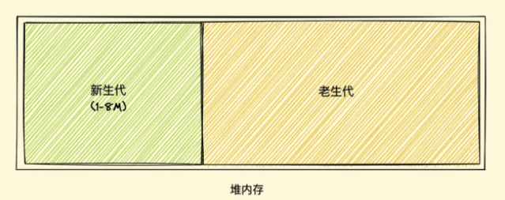
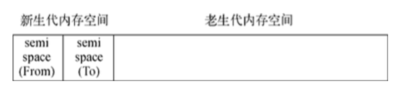

## V8 GC-垃圾回收机制(GarbageCollection)

所谓垃圾，就是内存中不会再被使用的部分
- 在 C/C++ 语言里面，我们可以手动分配 (malloc/new) 和 释放(free/delete) 内存，可以人工榨干资源。
- 在本来在虚拟机上抽象的语言，JavaScript/Java 则常在语言运行时中内置垃圾回收机制，虽然对开发者失去一定控制，但是也提高了开发效率和安全保证，而 JavaScript 的 GC 完全是由 V8 引擎决定，V8会帮助我们自动垃圾回收管理。

JavaScript 中通常会存在一些根对象，浏览器下是 `window`, Node 环境下是 `global`, 而 V8 中的垃圾回收器，通常都是找无法从根对象沿着引用遍历到的对象(即不可达的(unreachable)对象)进行回收。而 V8 中的垃圾回收时机通常出现在程序需要分配更多内存的时候，就是已分配的内存不够用的时候。因此 V8 的垃圾回收通常是由内存分配需、求触发的。触发 GC V8 会触发(2浅一深) GC，如果还是分配失败，V8 就会内存用尽退出。

### V8垃圾回收策略

1. 引用计数(Reference Counting)

其实是算最早的一种垃圾回收算法，它把 **对象是否不再需要**简化为，**对象有没有其它对象引用到它**，主要是跟踪记录每个值被引用的次数，当声明一个变量并将一个引用的类型值赋值给该变量时，则该变量次数就是1，如果该值引用次数变成 0 的时候，则说明没办法再访问这个值了，如果没有引用指向该对象（0引用），则对象将会被垃圾回收机制回收，不过在2012年起 V8 引擎对引用计数垃圾收集策略就不太使用了。

缺点: 如果当两个对象相互引用的时候，就会出现**循环引用**，引用计数这策略就没办法清除这循环的内存。

2. 标记清除(Mark-Sweep)
，**Mark-Sweep** 分为 **标记** 和 **删除** 两个阶段

- 垃圾收集器在内存中所有的变量都加一个标记0，假设所有对象都是垃圾
- 引擎执行 GC 时会从**根（全局 window 对象、文档 DOM 树）**开始遍历内存中所有的变量，去打标记，正在使用标为1， 如果当前引用已经脱离了当前根则不更改
- 然后清理所有标记为0的变量，并回收所占用的空间
- 最后把所有内存中对象标记为0，等待下一轮的垃圾回收

缺点:

3. 标记整理(Mark-Compact)

因为当垃圾回收后，一部分内存空间就会重新释放出来，会变成内存空间不连续，标记整理会重新把还在使用的重新整理，存放在内存的另一侧，重新排列会变成连续的内存空间。因为要连续的内存空间，所以相对速度会慢一些。

其实图画错了，会很清理后再整理

4. 标记清除整理(Mark-Sweep-Compact)
结合了上面两个，目前大多数浏览器 JavaScript 引擎都是采用**Mark-Sweep-Compact**策略，不同浏览器厂商会有相应的优化。

### V8垃圾回收空间分类

> 弱分代假设, GC 研究者观察到： 1.大多数对象死的早。 2. 那些列得不早的对象，通常倾向于永生

V8 的垃圾回收器会基于**[弱分代假设](https://developer.aliyun.com/article/592878)**，将 JavaScript 对象分成两类:

**新生代(new generation|young generation)**:
  - 大部分的新对象都诞生在新生代
  - 新生代中保存对象存活时间较短的对象
  - 新生代经历了两次 GC 还没被回收，就会晋升到老生代
  - 新生代采用 **Scavenge** 回收策略(拿空间换时间)，主要通过 **Cheney** 算法实现, **Cheney** 算法，会把内存一分为二，一部分记录内存对象，另一部分闲置，当一段时间后会重新把活跃对象整理到，闲置部分，再交替操作

  新生代堆空间:
  - **New Space**：新生代保存的堆内空间

**Scavenge**算法:

Cheney 算法是一种采用复制的方式实现的垃圾回收算法。它将堆内存一分为二，每一部分空间成为 semispace。在这两个 semispace 空间中，只有一个处于使用中，另一个处于闲置中。处于使用中的 semispace 空间成为 From 空间，处于闲置状态的空间成为 To 空间。当我们分配对象时，先是在 From 空间中进行分配。当开始进行垃圾回收时，会检查 From 空间中的存活对象，这些存活对象将被复制到 To 空间中，而非存活对象占用的空间将被释放。完成复制后， From 空间和 To 空间的角色发生对换。

Scavenge 的缺点是只能使用堆内存的一半，但 Scavenge 由于只复制存活的对象，并且对于生命周期短的场景存活对象只占少部分，所以它在时间效率上表现优异。Scavenge 是典型的牺牲空间换取时间的算法，无法大规模地应用到所有的垃圾回收中，但非常适合应用在新生代中。

**老生代(old generation)**:
  - 老生代中的对象为存活时间较长或常驻的对象
  - 老生代采用 **Mark-Sweep-Compact** 回收策略, 并减轻单独 **Mark-Sweep** 或 **Mark-Compact** 回收的问题

老生代堆空间包括：
  - Old Space：大部分保存新生代晋升而来的老对象
  - Large Object Space：保存超过 1M 的对象，由新对象直接放在这
  - Map Space: 堆上分配的对象都带有指向它的“隐藏类”(Map)就保存在 Map Space
  - Code Space: 编译器针对运行平台架构编译出的机器码和元数据，都放置在 Code Space 中

### GC 回收停顿

#### Stop-the-world(回收停顿)

Stop-the-world 找不到对应的中文翻译，它指的是在执行垃圾回收的过程中，运行时会暂停程序的执行：由于程序的执行可能会产生新对象，或者修改对象的引用，造成对象的生存状态改变，假如没有准备相应的手段确保程序执行时不会修改正处于回收过程中的对象，就必须暂停执行来保证对象能够被安全回收。这就好比在清洁阿姨上门打扫的过程中，如果你家里还有熊孩子在活动，就可能突然产生新的垃圾（打碎个花瓶啥的），或者原来是垃圾的东西突然被熊孩子们当成宝拿走，给阿姨添麻烦。

#### 增量式 GC（incremental）

即程序不需要等到垃圾回收完全结束才能重新开始运行，在垃圾回收的过程中控制权可以临时交还给运行时进行一定的操作

#### 并发式 GC（concurrent）

即在垃圾回收的同时不需要停止程序的运行，两者可以同时进行，只有在个别时候需要短暂停下来让垃圾回收器做一些特殊的操作

### 参考连接

[内存管理](https://developer.mozilla.org/zh-CN/docs/Web/JavaScript/Memory_Management)

[jsliang 求职系列 - 19 - 垃圾回收](https://juejin.cn/post/6896988786547228679)

[由一道腾讯面试题聊聊 V8 引擎的垃圾回收](https://mp.weixin.qq.com/s/cFGHz7FYG9CzpOE-QSMRDg)

[聊聊V8引擎的垃圾回收](https://juejin.cn/post/6844903591510016007#heading-10)

[解读 V8 GC Log（一）: Node.js 应用背景与 GC 基础知识](https://developer.aliyun.com/article/592878)

[解读 V8 GC Log（二）: 堆内外内存的划分与 GC 算法](https://developer.aliyun.com/article/592880)

[「硬核JS」你真的了解垃圾回收机制吗](https://juejin.cn/post/6981588276356317214#heading-4)

[理解 Node.js 的 GC 机制](https://cloud.tencent.com/developer/article/1699977)