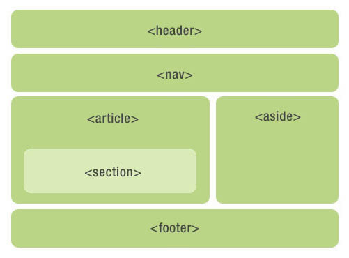

HTML5 语言标签

| 元素列表 | Element |                            Description                            |
|--------|:-------:|:-----------------------------------------------------------------:|
|   根元素     |   |  |
|   |&lt;html&gt;| 代表 HTML 或 XHTML 文档的根。其他所有元素必须是这个元素的子节点。 |
| 文档元数据 | | |
|  |&lt;head&gt;| 代表关于文档元数据的一个集合，包括脚本或样式表的链接或内容 |
|  |&lt;title&gt;| 定义文档的标题， 将显示在浏览器的标题栏或标签上。该元素只能包含文本，包含的标签不会被解释。 |
|  |&lt;base&gt;| 定义页面上相对 URL 的基准 URL。 |
|  |&lt;line&gt;| 用于链接外部的 CSS 到该文档。 |
|  |&lt;meta&gt;| 定义其他 HTML 元素无法描述的元数据。 |
|  |&lt;style&gt;| 用户内联 css 样式引用。 |
| 脚本 | | |
|  |&lt;script&gt;| 定认一个内联脚本或者外部脚本。脚本语言是 JavaScript |
|  |&lt;noscript&gt;| 浏览器不支持脚本时显示的替代文字。 |
|  |&lt;template&gt;| 通过 JavaScript 在运行时实例化内容的template容器。以前是通过 &lt;script type='text/template'&gt;&lt;/script&gt; 来访问模版内容，里面的内容被当做普通字符串处理，而新版 template 是可以把标签内内容转为DOM树被当做文档碎片DocumentFragment |
| 章节 | | |
|  |&lt;body&gt;| 代表html文档的内容，在文档中只能有一个`<body>` 元素。 |
|  |&lt;section&gt;| 表示文档中的一个章节的内容，里面一般会这个章节的标题和内容 |
|  |&lt;nav&gt;| 用来表示文档中导航链接的部分，常用来菜单，目录和索引等。 |
|  |&lt;article&gt;| 用来表示内容期余部分的独立上的内容，也包括会有标题和完整独立的内容块 |
|  |`<h1>,<h2>,<h3>,<h4>,<h5>,<h6>`| 标题元素实现了六层文档标题，`<h1>` 是最大的标题，`<h6>` 是最小的标题。标题元素简要地描述章节的主题。 |
|  |`<header>`| 主要用于展示介绍性内容，通常包含一组介绍性的或是辅助导航的实用元素。它可能包含一些标题元素，但也可能包含其他元素，比如 Logo、搜索框、作者名称，等等。 |
|  |`<footer>`| 用于表示最近一个章节内容或者根节点（sectioning root ）元素的页脚。一个页脚通常包含该章节作者、版权数据或者与文档相关的链接等信息。 |
|  |`<address>`| 用于放置提供了某个人或某个组织（等等）的联系信息。 |
|  |`<main>`| 主要用于呈现了文档的 `<body>` 或应用的主体部分。主体部分由与文档直接相关，或者扩展于文档的中心主题、应用的主要功能部分的内容组成。并且内容对于文档来说应当是唯一的。它不应包含在文档中重复出现的内容，比如侧栏、导航栏、版权信息、站点标志或搜索表单。`<main>` 元素不能是以下元素的后代：`<article>`、`<aside>`、`<footer>`、`<header>` 或 `<nav>`。 |
| 组织内容 | | |
|  |`
`| 该标签元素定义一个段落。 |
|  |`
`| 表示章节文章或其它内容中段落之间的分隔符，创建一条水平分隔线。 |
|  |`<pre>`| 元素可定义预格式化的文本，被包围在 pre 元素中的广西通常会保留空格和换行符，文本也会呈现为等宽字体。也能用来表示计算机的源代码。`<pre>`相对于 `<code>`, `<pre>` 表示单行代码显示，`<code>` 表示多行代码显示|
|  |`<blockquote>`| 表示标签内文字引用其它内容。 |
|  |`<ol>`| 定义有序列表。 |
|  |`<ul>`| 定义无序列表。 |
|  |`<li>`| 定义列表子项。 |
|  |`<dl>`| 定义一个定义列表，和`<ol>`、`<ol>`很像。 |
|  |`<dt>`| 在定义列表里面表示一个定义的标题或概念，紧接着后面的定义解释 `<dl>` |
|  |`<dd>`| 表示定义的解释，`<dt>` key 的值。|
|  |`<figure>`| 表示元素内独立的内容，经常与 `<figcaption>` 图例说明配合使用。`<figure>` 经常使用在主文中引用的图片，插图，表格，代码段等独立主体。|
|  |`<figcaption>`| 代表一个图例的说明。 |
|  |`
`| 表示一个无语义的通用容器。 |
| 文字形式 | | |
|  |`<a>`| 代表一个链接到其它资源的超链接。 |
|  |`<em>`| 强调文字标签。 |
|  |`<strong>`| 加粗文字表示特别重要的文字。 |
|  |`<small>`| 代表注释，如免责声明、版权声明等。 |
|  |`<s>`| 代表不准确或不相关的内容。 |
|  |`<cite>`| 代表作品标题。 |
|  |`<q>`| 代表内联的引用标签，会在内容文本中加入双引号。 |
|  |`<dfn>`| 表示一个术语包含在其最近祖先内容中的标签。 |
|  |`<abbr>`| 表示缩写的文本，其完整的内容在`title`属性里面。 |
|  |`<data>`| 关联一个数据的内容标签，程序可以通过css或脚本等形式读取。 |
|  |`<time>`| 表示时间和日期, 标签内必须是时间格式才能被浏览器读取并引用。`<time>` 属性有两个值 `datetime`表示有效的日期格式，并会有一个关联的时间戳。`pubdate`表示文章唯一发布的时间。 |
|  |`<code>`| 标签内示意为多行代码。 |
|  |`<var>`| 可以用在行内元素内表示变量，还可以自定义变量样式。 |
|  |`<samp>`| 代表程序或机算机的输出文本样式 |
|  |`<samp>`| 代表用户输入，或者语音输入，键盘输入的文本样式。 |
|  |``| 代表下标和上标文本样式。 |
|  |`<i>`| 标签指示不同性质的文字、比如技术术语，外文短语等。 |
|  |`<b>`| 代表一段需要被关注的文字，文本样式粗体变化。 |
|  |`<u>`| 代表一段需要下划线呈现的文本注释，如拼写错误或标记等。 |
|  |`<mark>`| 代表一段需要被高光划重点引用的文字。 |
|  |`<ruby>`| 代表标记文本拼音注释的一个组合。如中文汉字和它的拼音，通常和`<rt>`、`<rp>`一起使用。 |
|  |`<rt>`| 代表注释文本`<ruby>`里面的拼音部分。 |
|  |`<rp>`| 代表注释文本`<ruby>`里面的注释拼音额外插入的文本，用于在不支持`<ruby>`注释显示的浏览器中提供友好的兼容显示。 |
|  |`<bdi>`| 代表需要脱离父元素文本方向的一段文本。它允许嵌入一段不同或未知文本方向的格式文本。文本方向由浏览器决定。 |
|  |`<bdo>`| 和`<bdi>`相同都是决定文本方向的，可以通过属性`dir`显式定义文本方向。|
|  |``| 定义一段没有特殊含义的文本，当其他语义元素都不适合文本时可以使用该元素。|
|  |` `| 换行标签。 |
|  |`<wbr>`| 建议换行标签(Word Break Opportunity), 当文本太长需要换行时将会在此处添加换行符。 |
| 编辑 | | |
|  |`<ins>`| 表示文档中重新增加插入到文档的内容，通常和`<del>`一起使用 |
|  |`<del>`| 标示文档中删除的内容，通常和`<ins>`一起使用,表示文档的修改 |
| 嵌入内容 | | |
|  |``| 代表引入一个图片的标签 |
|  |`<iframe>`| 表示引入一个内联的框架。|
|  |`<embed>`| 将外部内容嵌入文档中，此内容由外部应用程序或其他交互式内容源提供。|
|  |`<object>`| 代表一个外部资源，如图片、HTML子文档、插件等。`<object>`相比于`<embed>`会更好用一些。`<object>`可以包含`<embed>`来兼容一些旧的浏览器。|
|  |`<param>`| 一般用在 `<object>` 标签里面，表示插件里面所需要的一些参数。|
|  |`<video>`| 代表一段视频及视频文件和字幕，并提供了播放视频的用户界面。|
|  |`<audio>`| 表示一段声音或者音频流文件。|
|  |`<source>`| 为`<video>`或`<audio>`这类媒体元素只定媒体源。|
|  |`<track>`| 为`<video>`或`<audio>`这类媒体元素指定文本轨道(字幕)|
|  |`<canvas>`| 代表位图区域，可以通过脚本在它上面实时呈现图形，如图表、游戏绘图等。|
|  |`<map>`| 一般用来和图片做映射和`<area>`配合映射图片上面的区域。 |
|  |`<area>`| 和 `<map>` 配合，表示具体图片上面的区域。 |
|  |`<svg>`| 定义一个嵌入式矢量图。|
|  |`<math>`| 定义一段数学公式。|
| 表格 | | |
|  |`<table>`| 表示表格元素。|
|  |`<caption>`| 在表格元素里面表示表格标题 |
|  |`<colgroup>`| 在表格元素里面表示单列群组或多列群组。 |
|  |`<col>`| 在表格里面表示列元素。 |
|  |`<thead>`| 在表格中表示表头，可以在里面定义每一列的标签。 |
|  |`<tbody>`| 在表格中表示表格主体数据，可以在里面定义每一行一列的数据。 |
|  |`<tfoot>`| 在表格中表示表格表尾，可以定义总金额等汇总数据。 |
|  |`<tr>`| 在表格里面表示一行。 |
|  |`<td>`| 在表格里面表示单元格。 |
|  |`<th>`| 在表格里面表示头部中的单元格。|
| 表单 | | |
|  |`<form>`| 代表一 个有单，由控件组成。|
|  |`<fieldset>`| 在表单里面代表一个控件组，里面有控件组的标题，和各控件。|
|  |`<legend>`| 在控件组`<fieldset>`里面，表示控件组的标题。|
|  |`<label>`| 表示单个控件的标题和文本。|
|  |`<input>`| 代表用户编辑数据的数据区(有文本框，单选框、复选框等类型)。|
|  |`<button>`| 代表按钮。|
|  |`<select>`| 代表下拉框元素。在元素里面通过 `<option>` 表示选项的值。在选项框里面可以选预选的值。|
|  |`<datalist>`| 代表很像一个下拉列表，但是它只是提供一个数据的选择，并且不限制你在输入框中输入任何内容。|
|  |`<datalist>`| 代表很像一个下拉列表，但是它只是提供一个数据的选择，并且不限制你在输入框中输入任何内容。|
|  |`<optgroup>`| 代表一个选项值的分组，在选项值里面显示分组。|
|  |`<option>`| 代表一个选项常用在`<select>`或`<datalist>`元素中。|
|  |`<textarea>`| 代表多行文本框。|
|  |`<keygen>`| 代表一个密钥对生成 控件。|
|  |`<output>`| 代表输出计算的值。|
|  |`<progress>`| 代表进度条。|
|  |`<meter>`| 用来显示已知范围的标量值或者分数值。|
| 交互元素 | | |
|  |`
`| 创建一个挂件，仅在切换成展开状态时，它才会显示内含的信息内容。|
|  |`
`| 在`
`内容里面表示详情标题。|
|  |`<menuitem>`| 创建一个用户可以点击的菜单项目，包括上下文菜单，以及 按钮可能附带的菜单。|
|  |`<menu>`| 创建珍上菜单。|

 

